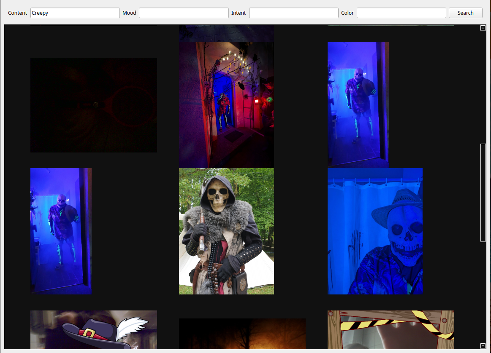

# OLLIMCA (OLLama IMage CAtaloguing)

(Licensed under GPLv3. See the LICENSE file for details.)

This small tool crawls through all the images in directories and their subdirectories and sends 
them to a LLM with vision running on a local instance of 'ollama' ( https://ollama.com )
The LLM then writes a description of the image which is stored in a database. 

You can then use the provided stand-alone frontend to search for images featuring the keywords you enter.


a small video tour of Ollimca can be found here : (https://www.youtube.com/watch?v=LFs3BUsdsxA)

### changelog :
* 0.2.5:
  * an actual Version Tag! Happy New Year (2).0.2.5!
  * new CLI Tool : tag_faces.py (needs a GPU!), and very error prone!
  * new popup menu to select (allegedly) recognized faces 
  * multiple bug fixes
* 0.0.0:
  * (new) right clicking brings up the generated description for the current image
  * added a checkbox in the search frontend to physically delete duplicate images (based on their checksum) and then
  remove missing files from the databases. (please see the notes!)

### requirements : 
* python3.x 
* ollama (https://ollama.com)
* to query the database : `nomic-embed-text` or another embedding model installed. (install with `ollama pull nomic-embed-text`) 
* to analyse the images : a vision model from the ollama library (moondream, llama3.2-vision, llava, bakllava, ...)
* for face recognition, make sure the models are installed with :` pip install git+https://github.com/ageitgey/face_recognition_models`
 and update your setup tools with 'pip install --upgrade setuptools'


*a note about a requirements*: analysing the images is a lengthy process that taxes your processor (GPU or CPU) quite a
  bit. A PC running Windows or (better) Linux with a GPU supported by ollama, or an M series Apple Mac (slower than 
  a GPU in many cases, but still *much* better than just a standard CPU) is highly recommended
  
Querying the databases, on the other hand, is fast and doesn't take much power. Basically any computer that can run 
ollama and python, even on the CPU and has at least 8GB RAM (it might still work with 4GB, but I can't test it) should be 
enough. I run the embedding for the queries on a raspberry pi 5/8GB and, apart from the initial delay when the embedding
model is loaded, queries take less than a second to return results. 

This means that if you put your images and the database folder on a shared directory, you can use your most powerful 
system to analyze all the images, and let every computer that can run the frontend do queries! 
  
### installation :

You will need python3 with venv installed. 

On Linux:
run ```./install.sh```

update config.yaml with the relevant data. The chromadb and sqlite paths are just the name of the files created. 
They will be located in the 'db' directory. 

## about the config and the default LLMs :
The default embedding model (nomic-embed-text) works qwell even without a GPU. I run mine when querying on a 
raspberry pi 5/8GB. Querying an existing database is therefore completely realistic with very low specs!
*Generating* the database, on the other hand, will **not work** with the default vision model, moondream2, on a CPU bound
system!
There is a bug in ollama's upstream inference engine (llama.cpp) which breaks moondream2. It works fine on GPU though!
The next 'smallest' model would be either a highly quantized Llava:7b or llama-phi3, but both options are a LOT slower
than moondream and need much more ram.

Databases are stored in db/ in the root directory.

Do not forget to set an image viewer that should be started when an image is clicked.  (/usr/bin/gwenview if you are
using KDE for example)

### usage :

Run ```./start_server.sh``` to start the crawler webserver 
Open http://localhost:9706  to open the crawler's page. Enter a directory with images in it, press
the button ... and wait. Like seriously ... On my system (i7-10700k, 64GB RAM, RTX3090/24GB) the program crawls through
approximately 1200 images per hour. Depending on the amount of image files, you might be looking for weeks to get through
everything. Luckily you can stop the process anytime and continue later on.

Also : please note that only jpg, jpeg and png files are looked at (the case is irrelevant, jpg and JPG work!)

You can then use the search frontend with ```./start_frontend.sh``` to search through the images that were 
analyzed so far. The frontend is standalone. Thankfully, the search itself is very fast. 

Right Clicking in the frontend will show you the description generated by the LLM

#### Face Recognition:
**This REALLY needs a decent GPU to work and is still highly experimental!**

Make sure you have indexed all your photos and made a backup of your db folder!  
Put an image of the face of the person ( or persons ) you want to tag in the directory 'faces', name the image
PERSONS_NAME.jpg ( so, for example, sammy.jpg ). 

Activate the virtual environment

```source ollivenv/bin/activate```

then start the tagger.

```python tag_faces.py```

It will crawl through all the images in the database and try to recognize the faces 
of each person whose portrait is found in the faces directory.

*this will take a very long time!*

Once it is done you should get a list of persons to search for in the search window when
you press the button. The tool will now only return images which it thinks contains said person(s).
The search is looking for ANY of the selected persons, and will also try to constrain the results to 
the search terms you entered.

**Did  I mention that this particular feature is really experimental?**

### notes :
#### about *delete and remove duplicates*:
This option will slow down search queries. Checksums for each image that is supposed to be displayed is computed on the fly
and that can take some time. No image will be deleted physically for now, as I don't want this on without further testing!
You can reenable that function if you want : just uncomment the line `os.remove(image_path)` in the function `check_duplicate()`
in `query.py`. In my only test run the programm deleted a bunch of images and I'm not sure it was right (yet), so if you
reenable it, it's at your own risks and peril!

#### about *queries*:
The keywords are first searched in the content text and the path of each image, and then semantically in a vector database, 
which means that will ALWAYS return something, even if the terms you entered are not found 'literally'. Searching 
for, for example, 'pinguin' will return pictures of pinguins, but also of other birds, the sea, possibly fish and ice too, 
with decreasing probability that the image is relevant the longer you scroll down.

Also : the way LLMs work mean that the description may or may not be accurate. Sometimes (often?) you will be wondering why
a certain image appears on a certain keyword. This is, if not intended, at least a useful 'bug', as it makes you rediscover 
photos you didn't even know you had and let you relive old memories you had forgotten ... at least it did for me.

#### about *images*:
Images that are too big will not get a thumbnail, and will instead displayed as a 'image not available' textfield. You can 
still click to open them in your external viewe.

This is a work in progress,so expect bugs, weird happenstances and missing features you just don't get why I didn't 
implement them yet ... ¯\_(ツ)_/¯

Heads up to the nice folks on the ollama Discord Server for their cheering and verbal abuse.

<a href="https://www.buymeacoffee.com/socialnetwooky" target="_blank"></a>




